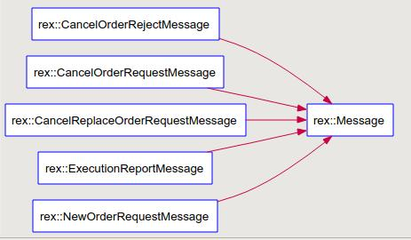

程序结构分析
=====================================

总体结构
----------------
Rex这个程序实现了股票交易平台的功能。底层基于ACE通信框架和[FIX协议](http://en.wikipedia.org/wiki/Financial_Information_eXchange)（交易所使用的
标准协议）
具体来说，Rex监听一个端口，然后接受FIX格式的消息，从消息格式分析出是下单还是取消
订单，然后针对某一种股票配对，当Bid价格>=Ask价格时配对成功，返回给下单的双方。

控制流
----------------
### 初始化
main
  ->Exchange::run
    ->OrderBookManager::init 针对每一种股票构造一个OrderBook
### 交易
FixMessageHandler::onMessage 接受到网络消息，通过重载接口来接受不同类型的Message。
  ->构建内部表示的消息，例如NewOrderRequestMessage/CancelOrderRequestMessage/CancelReplaceOrderRequestMessage
  ->OrderBookManager::process 处理消息：根据消息对应的股票名，将消息封装为ACE_Message_Block，放到不同OrderBook的消息队列中。
    ->OrderBook::put
      ->putq
OrderBook::svc
  ->getq 从消息队列获取自己这只股票的消息,即前面putq放入的消息。
  ->Message::process 处理消息
    ->调用OrderBook::remove/OrderBook::match/OrderBook::add进行交易的删除/匹配/添加操作。
### 几种消息的关系

### 评价
这个系统最后更新是2010年，更新次数很少，缺少文档，是一个过度性代码,离工业级别的
代码还有距离。

TODO
----------------
更多的代码细节还有待研究，比如FIX协议本身和开源的包。

比特币交易是否有标准通信协议?
